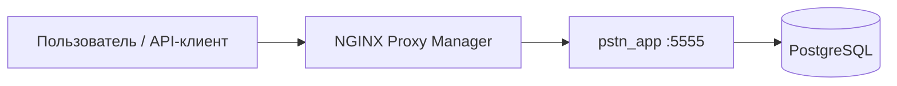

# PSTN Analytics

Веб-сервис аналитики телефонного плана нумерации Российской Федерации на основе открытых CSV Минцифры и реестра операторов OPR (УВр Антифрод).

## О проекте

Разработано оператором телефонной связи для бизнеса [Finenumbers](https://finenumbers.com).  
По всем вопросам: [apps@finenumbers.com](mailto:apps@finenumbers.com)

**Репозиторий:** https://github.com/finenumbers/pstn

**Стек:** Next.js 15, React 19, TypeScript, PostgreSQL 16, Drizzle ORM, TanStack Table/Query, shadcn/ui, Tailwind CSS 4.

---

## Архитектура



В production приложение рассчитано на работу **за reverse proxy** (NGINX Proxy Manager). Встроенной авторизации (логин/пароль, сессии) **нет** — доступ к UI и internal API защищается на периметре (Access List, Basic Auth, VPN). Подробнее: [docs/security.md](docs/security.md).

Compose-стек проекта содержит **только** PostgreSQL и приложение. NPM, Portainer и SSL настраиваются отдельно.

| Compose-файл | Назначение |
|--------------|------------|
| [docker-compose.dev.yml](docker-compose.dev.yml) | Локально: только PostgreSQL; Next.js на хосте |
| [docker-compose.yml](docker-compose.yml) | Локально: полный стек (PG + app) |
| [docker-compose.prod.yml](docker-compose.prod.yml) | Production через CLI и `.env` |
| [docker-compose.portainer.yml](docker-compose.portainer.yml) | Production через Portainer |

---

## Документация

| Раздел | Содержание |
|--------|------------|
| [docs/deployment.md](docs/deployment.md) | Деплой: dev, Docker, VPS, Portainer, NPM, переменные окружения |
| [docs/security.md](docs/security.md) | Модель безопасности, секреты, заголовки, threat model |
| [docs/user-guide.md](docs/user-guide.md) | UI `/ranges`: фильтры, импорт, экспорт, KPI |
| [docs/api-reference.md](docs/api-reference.md) | HTTP API: endpoints, auth, лимиты, примеры |
| [docs/operations.md](docs/operations.md) | Эксплуатация: backup, обновление, troubleshooting |

Шаблоны переменных: [.env.example](.env.example), [.env.production.example](.env.production.example), [portainer.env.example](portainer.env.example).

---

## Quick start

### Локальная разработка

```bash
cp .env.example .env
npm run docker:dev-db    # PostgreSQL в Docker
npm install
npm run db:migrate
npm run dev              # http://localhost:5555/ranges
```

### Docker Desktop (полный стек)

```bash
docker compose up -d --build
# http://localhost:5555/ranges → «Загрузить данные»
```

### Production (VPS)

Рекомендуемые ресурсы: **4 GB RAM**, **20–50 GB** диск, Ubuntu 22.04/24.04 или Debian 12.

```bash
git clone https://github.com/finenumbers/pstn.git /opt/pstn && cd /opt/pstn
cp .env.production.example .env   # задайте пароли
./scripts/deploy.sh
curl http://127.0.0.1:5555/api/health
```

Далее: NPM → SSL → Access List → первая загрузка данных. Пошагово: [docs/deployment.md](docs/deployment.md).

---

## Основные команды

```bash
npm run docker:up          # build + start (docker-compose.yml)
npm run docker:prod        # production compose
npm run docker:portainer   # Portainer compose локально
npm test                   # unit/integration tests
npm run audit              # npm audit --audit-level=high
```

---

## Данные

Импорт — **только вручную** через UI («Загрузить данные») или `POST /api/import`. Автоимпортов и расписаний в проекте нет. Источник: четыре CSV с [opendata.digital.gov.ru](https://opendata.digital.gov.ru). Реестр OPR для колонки «УВр Антифрод» загружается отдельным скриптом — см. [docs/operations.md](docs/operations.md).
