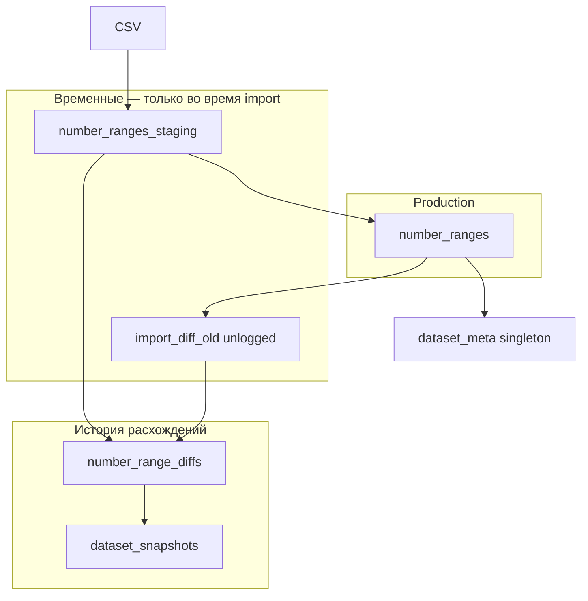
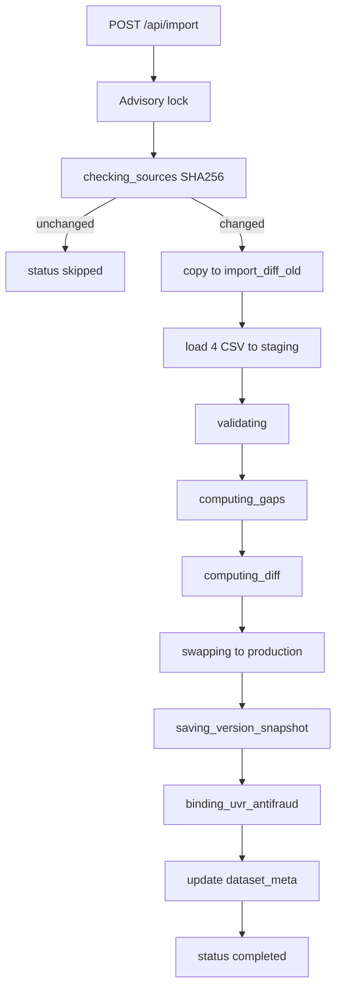

# Импорт данных, cron и diff snapshots

Опорный документ по загрузке CSV Минцифры, ежедневному автоимпорту и просмотру расхождений между версиями датасета.

**Аудитория:** разработчики, администраторы, продвинутые пользователи UI.  
**См. также:** [user-guide.md](user-guide.md) (UI), [api-reference.md](api-reference.md) (HTTP API), [operations.md](operations.md) (эксплуатация), [deployment.md](deployment.md) (деплой scheduler), [security.md](security.md) (auth import).

---

## Зачем это нужно

PSTN Analytics хранит ~446k телефонных диапазонов из четырёх открытых CSV [opendata.digital.gov.ru](https://opendata.digital.gov.ru). Данные обновляются регулярно; без автоматизации пользователь должен был бы вручную нажимать «Загрузить данные» каждый день.

Система решает две задачи:

1. **Актуальность** — в production ежедневно в 18:00 MSK запускается cron-импорт. Если файлы не изменились (SHA256 совпадает с сохранённым хешем), job завершается со статусом `skipped` без изменения production.
2. **Прозрачность изменений** — если CSV изменились, после успешного import сохраняется **snapshot расхождений** (diff snapshot): можно посмотреть в UI, какие диапазоны добавились, изменились или удалились по сравнению с предыдущей версией.

---

## Глоссарий

| Термин | Значение |
|--------|----------|
| **Current dataset** (`current`) | Актуальная production-таблица `number_ranges` — то, что видно по умолчанию в UI |
| **Diff snapshot** (snapshot расхождений) | Снимок строк из `number_range_diffs`, привязанный к записи в `dataset_snapshots` |
| **Load date** | Календарная дата загрузки в часовом поясе **Europe/Moscow (MSK)**; используется в подписи «Датасет DD.MM.YYYY» / «Расхождения DD.MM.YYYY» |
| **Skip** | Import job со статусом `skipped` и `skipReason: "unchanged"` — CSV не изменились, production не трогали |
| **Staging** | Временная таблица `number_ranges_staging` — сюда загружаются CSV до атомарной подмены production |
| **changeType** | Тип сегмента в diff: `added`, `changed`, `removed` |
| **prev\*** | Поля «было до изменения» для сегментов типа `changed` и `removed` |

---

## Три режима данных



| Режим | Таблица | Когда доступен |
|-------|---------|----------------|
| Production | `number_ranges` | Всегда; query param `dataset=current` (default) |
| Staging | `number_ranges_staging` | Только во время running import |
| Full version | `number_range_full_snapshots` + filter по `snapshot_id` | После первого import (baseline) и каждого import с diff; query `asOf=YYYY-MM-DD` или `dataset=full:<uuid>` |
| Diff snapshot | `number_range_diffs` + filter по `snapshot_id` | После import с ненулевыми расхождениями; query param `dataset=diff:<uuid>` |

---

## Pipeline импорта

### Общая схема



### Фазы и что видит пользователь

| Фаза (`progressPhase`) | Действие | Таблицы | UI (карточка прогресса) |
|------------------------|----------|---------|-------------------------|
| `checking_sources` | SHA256 четырёх CSV vs `dataset_meta.source_hashes` | — | «Сравнение с текущим датасетом…» |
| `skipped_unchanged` | Job завершён, production не менялся | — | «Данные актуальны» (синяя карточка) |
| `clearing_staging` | Очистка staging | `number_ranges_staging` | «Подготовка к загрузке…» |
| `loading_<file>` | Загрузка одного CSV | staging | Сетка 4 файлов, текущий — «загрузка…» |
| `loaded_<file>` | Файл загружен | staging | Файл отмечен done |
| `validating` | Проверка полноты (100% строк) | staging | «Проверка полноты данных…» |
| `computing_gaps` | Расчёт пропусков ABC | staging | «Расчёт пропусков…» |
| `computing_diff` | Сравнение old vs new ranges | `import_diff_old`, staging | «Анализ расхождений…» |
| `swapping` | Атомарная подмена production | `number_ranges` | «Обновление таблицы…» |
| `saving_version_snapshot` | Копия production в `number_range_full_snapshots` (+ diff rows при изменениях) | `dataset_snapshots`, `number_range_full_snapshots`, `number_range_diffs` | «Сохранение версии датасета…» |
| `binding_uvr_antifraud` | OPR + привязка УВр | `operators_register` | «Привязка УВр Антифрод…» |
| `completed` | Meta + hashes обновлены | `dataset_meta` | «Загрузка завершена» (зелёная) |
| `failed` | Ошибка до или после swap* | staging truncated | «Загрузка не завершена» (красная) |

\* При ошибке **до** `swapping` production **не изменён**. При ошибке после swap данные уже обновлены — повторите import или восстановите из backup.

### Инварианты (production-grade)

1. **Hash gate** — при совпадении SHA256 import завершается как `skipped`; production, staging и temp-таблицы не меняют содержимое `number_ranges`.
2. **Fail-before-swap** — validation, parse errors, incomplete CSV → `failed` до подмены production.
3. **Advisory lock** (`pg_advisory_xact_lock`) — только один import одновременно; повторный `POST /api/import` возвращает существующий running job.
4. **Snapshot после swap** — diff snapshot записывается только после успешной подмены production; при падении до swap orphan snapshot не остаётся.
5. **Upsert по load_date** — один snapshot на MSK-день; повторный import с diff в тот же день перезаписывает snapshot (без нарушения UNIQUE).
6. **Snapshot только при ненулевом diff** — если алгоритм не нашёл сегментов (`segments.length === 0`), запись в `dataset_snapshots` не создаётся; пункта «Расхождения» в селекторе не будет.

### Источники данных

| Файл | Примерный объём |
|------|-----------------|
| ABC-3xx.csv | ~69k строк |
| ABC-4xx.csv | ~270k строк |
| ABC-8xx.csv | ~70k строк |
| DEF-9xx.csv | ~15k строк |

URL задаются в `packages/import/constants.ts`. Загрузка идёт последовательно; хеширование — тоже последовательно (снижение нагрузки на opendata.digital.gov.ru).

### Stale recovery

Если job в статусе `pending` или `running` не обновлял heartbeat (`updated_at`) **45 минут**, при следующем `startImportJob` или перезапуске сервера он помечается `failed` с сообщением *«Import interrupted by server restart or timeout»*. Выполняется очистка: `TRUNCATE number_ranges_staging`, `DROP import_diff_old`.

Константа: `STALE_IMPORT_JOB_MS = 45 * 60 * 1000` в `packages/import/importJobConstants.ts`.

---

## Алгоритм diff

Реализация: `packages/import/rangeDatasetDiff.ts`.

1. Для каждого ABC-кода строятся границы диапазонов из **старого** (`import_diff_old`) и **нового** (staging) датасетов.
2. Границы разбивают числовую ось на **атомарные сегменты**.
3. Каждый сегмент классифицируется:
   - **added** — есть только в новом датасете;
   - **removed** — есть только в старом;
   - **changed** — сегмент есть в обоих датасетах, но **отличаются метаданные** на этом span: `operator`, `inn`, `region`, `garTerritory` или `capacity` при том же диапазоне;
   - сегмент **не попадает в diff**, если он покрыт обоими датасетами и метаданные **идентичны**, даже если родительские границы CSV изменились (обрезка без смены оператора/ИНН и т.д.).
4. Перед поиском покрывающего диапазона строки **сортируются** по `rangeStart` (per ABC) — детерминизм на плотных данных.
5. Соседние сегменты одного типа **сливаются** (`mergeAdjacentSegments`), если совпадают и `prevRangeStart`/`prevRangeEnd` (для `changed`).
6. Для `changed` в поля `prevRangeStart`, `prevRangeEnd`, `prevOperator`, `prevInn` и др. записываются значения **сегмента** из старого датасета (не всего parent range).

**Пересчёт:** существующие snapshots в БД не обновляются SQL-скриптом; новая логика применяется при **следующем** import с ненулевым diff.

### Пример: усечение диапазона (те же метаданные)

Было: `383 3990000–3999999`. Стало: `383 3990000–3998888` (оператор и ИНН без изменений).

| changeType | Диапазон | Цвет в UI |
|------------|----------|-----------|
| removed | 383 3998889–3999999 | Красный |

Жёлтая строка на `383 3990000–3998888` **не создаётся** — метаданные на этом span не изменились.

### Пример: смена оператора + удаление в середине

Было: `ABC 5500–10999` оператор A. Стало: `5500–5599` оператор B, `6000–10999` оператор A (400 номеров `5600–5999` удалены).

| changeType | Диапазон | Старый → новый оператор |
|------------|----------|-------------------------|
| changed | 5500–5599 | A → B |
| removed | 5600–5999 | A → — |

Хвост `6000–10999` с оператором A **не показывается** — метаданные совпадают со старым покрытием на этом span.

---

## Модель данных (PostgreSQL)

Мigrations: `0017_dataset_hashes.sql`, `0018_dataset_snapshots.sql`.

### `dataset_meta` (singleton, `id = 1`)

| Поле | Назначение |
|------|------------|
| `last_success_at` | Время последнего успешного import (UTC) |
| `last_job_id` | UUID job |
| `total_rows`, `total_capacity`, … | Глобальная статистика KPI |
| `source_hashes` | JSON SHA256 четырёх CSV для skip |

### `dataset_snapshots`

| Поле | Назначение |
|------|------------|
| `id` | UUID snapshot (используется в `dataset=diff:<uuid>`) |
| `load_date` | DATE, MSK; **UNIQUE** — один snapshot на календарный день |
| `job_id` | FK на `import_jobs` |
| `added_count`, `changed_count`, `removed_count` | Статистика для UI |

### `number_range_diffs`

Строки расхождений с `change_type`, текущими полями диапазона и optional `prev_*`.

### `import_jobs`

| Поле | Назначение |
|------|------------|
| `status` | `pending`, `running`, `completed`, `failed`, `skipped` |
| `triggered_by` | `manual` или `cron` |
| `skip_reason` | `"unchanged"` при skip |
| `progress_phase` | Текущая фаза pipeline |
| `file_rows` | JSON: строки по каждому CSV |
| `updated_at` | Heartbeat для stale detection |

### `import_diff_old`

Unlogged temp-таблица — копия данных `number_ranges` (без `id`) на момент начала import. Существует только во время running import.

### Политика хранения

- **Автоматического удаления** старых diff snapshots **нет** — они накапливаются в БД.
- Backup PostgreSQL включает snapshots; при восстановлении backup восстанавливается и история расхождений.
- Повторный import с diff **в тот же MSK-день** перезаписывает snapshot этого дня (upsert по `load_date`).

---

## HTTP API (сводка)

Полный контракт: [api-reference.md](api-reference.md).

### Параметр `dataset`

| Значение | Описание |
|----------|----------|
| `current` (default) | Таблица `number_ranges` |
| `diff:<uuid>` | Таблица `number_range_diffs` с фильтром `snapshot_id = uuid` |

Поддерживается на: `/api/ranges`, `/api/ranges/facets`, `/api/summary`, `/api/export/ranges`, `/api/v1/lookup/search`.

**Не поддерживается** на exact lookup: `GET /api/v1/lookup?phone=...` всегда ищет в current production.

### Mapping: `GET /api/datasets` → query param

Ответ `GET /api/datasets` возвращает массив `items`. Поле `id` **не совпадает** с форматом query param для diff:

| kind | `id` в ответе | Query param |
|------|---------------|-------------|
| `current` | `"current"` | `dataset=current` (можно опустить) |
| `diff` | UUID без префикса, напр. `550e8400-e29b-41d4-a716-446655440000` | `dataset=diff:550e8400-e29b-41d4-a716-446655440000` |

Пример:

```bash
# Список датасетов
curl -s "http://127.0.0.1:5555/api/datasets"

# Запрос diff snapshot (UUID из items[].id)
curl -s "http://127.0.0.1:5555/api/ranges?dataset=diff:550e8400-e29b-41d4-a716-446655440000&pageSize=10"
```

### Import API

```bash
# Ручной import (UI или curl)
curl -X POST "http://127.0.0.1:5555/api/import" \
  -H "Content-Type: application/json"

# Cron import (scheduler)
curl -X POST "http://127.0.0.1:5555/api/import" \
  -H "Content-Type: application/json" \
  -H "X-Import-Secret: YOUR_SECRET" \
  -d '{"triggeredBy":"cron"}'

# Статус
curl -s "http://127.0.0.1:5555/api/import/status?jobId=<uuid>"
```

### Коды ошибок

| Code | HTTP | Когда |
|------|------|-------|
| `VALIDATION_ERROR` | 400 | Невалидный `dataset=diff:not-a-uuid` |
| `DATASET_NOT_FOUND` | 404 | UUID snapshot не найден в БД |
| `UNAUTHORIZED` | 401 | Неверный или отсутствующий import secret / API key |

---

## UI

Страница `/ranges` — компоненты `RangesPageContent`, `DatasetDatePicker`, `DatasetSelector`, `ImportProgressCard`, `RangesTable`. Заголовок: **«Телефонная нумерация России»**.

### Панель действий (порядок)

**Сбросить фильтры** → **Дата датасета** → **Датасет** → **БД** → **API** → **XLSX** → **Загрузить данные**.

### Селектор датасета и календарь

- **«Датасет DD.MM.YYYY»** — current; дата = MSK-день последнего успешного import (`dataset_meta.last_success_at`).
- **«Расхождения DD.MM.YYYY»** — diff snapshot; список из `GET /api/datasets`.
- **Дата датасета** (`DatasetDatePicker`) — рабочий выбор исторической версии: поле ДД.ММ.ГГГГ + календарь; даты версий из `GET /api/datasets/change-dates`; **синий фон** в календаре = день версии (первая загрузка или import с snapshot).
- **БД: X ГБ** — `GET /api/storage`.
- Во время import селектор датасета и календарь disabled.

### URL

Фильтры, сортировка, датасет и `asOf` сохраняются в query string:

```
/ranges?filters.operator=...&sort=abc:asc&dataset=diff:550e8400-e29b-41d4-a716-446655440000&asOf=2026-06-22
```

Кнопка «Назад»/«Вперёд» восстанавливает состояние. **«Сбросить фильтры»** очищает фильтры, сортировку, **`asOf`** и возвращает **`dataset=current`**.

При неверном или удалённом snapshot UUID API вернёт 404; UI автоматически переключится на current и покажет toast «Снимок расхождений не найден, показан текущий датасет».

### Diff view

| Цвет | changeType |
|------|------------|
| Зелёный | added |
| Жёлтый | changed |
| Красный | removed |

Легенда — под таблицей. В diff mode отключены красные ABC-gap маркеры и специальная подсветка Frontir/9xx.

**Колонки таблицы в diff mode (UI):** ABC, Начало, Конец, Ёмкость, Оператор связи, Регион, Территория ГАР, УВр Антифрод, ИНН, **Изменения**. Отдельных колонок «Старый/Новый оператор» и «Старый/Новый ИНН» в UI **нет** — old/new доступны в диалоге «было / стало» по клику на «Изменения».

Фильтр **`filters.changedFields`** (колонка «Изменения»): OR по полям `operator`, `region`, `garTerritory`, `inn`, `added`, `removed`. Фильтры по оператору и ИНН — по **новым** значениям в snapshot.

Фильтры (включая Coverage AND), KPI, facets и экспорт XLSX работают в diff mode. **XLSX** дополнительно содержит «Тип изменения» и колонки old/new оператор и ИНН (см. [api-reference.md](api-reference.md#ui-vs-xlsx-в-diff-режиме)).

### Карточка import

| status | Внешний вид |
|--------|-------------|
| running / pending | Синяя, progress bar, сетка 4 файлов |
| completed | Зелёная, «Загрузка завершена» |
| skipped | Синяя, «Данные актуальны»; **без** сетки файлов и счётчика «4/4» |
| failed | Красная, текст ошибки, кнопка «Загрузить снова» |

Карточка auto-dismiss через 8 секунд после `completed` или `skipped`.

---

## Cron и scheduler

### Где есть scheduler

| Compose | Scheduler |
|---------|-----------|
| `docker-compose.prod.yml` | Да (`pstn_scheduler`) |
| `docker-compose.portainer.yml` | Да |
| `docker-compose.yml` (local) | **Нет** |
| `docker-compose.dev.yml` | **Нет** |

Локальная разработка: import только вручную (UI или curl).

### Конфигурация

- Образ: `alpine:3.21` + `curl` + `crond`
- `CRON_TZ=Europe/Moscow`
- Расписание: **`0 18 * * *`** (ежедневно 18:00 MSK)
- Скрипт: `/usr/local/bin/pstn-cron-import.sh`
- Запрос: `POST http://app:${APP_PORT}/api/import` с `{"triggeredBy":"cron"}` и `X-Import-Secret`
- Лог: `[pstn-cron] HTTP <code> <json body>`

Проверка:

```bash
docker compose -f docker-compose.prod.yml logs scheduler --tail 50
```

---

## Безопасность и IMPORT_SECRET

Модель auth: [security.md](security.md).

| Сценарий | Функция | Secret |
|----------|---------|--------|
| UI «Загрузить данные» | `checkImportAuthorization` | Если `IMPORT_SECRET` **не задан** — OK. Если задан — UI **не шлёт header** → **401** |
| Cron scheduler | `requireImportSecret` | Secret **обязателен**; без него cron всегда 401 |
| `GET /api/import/status` | `checkImportAuthorization` | Как manual |

### Конфликт production

Standard prod stack **требует** `IMPORT_SECRET` для scheduler (compose validation `:?`). Secret передаётся и в **app**, и в **scheduler**. В результате кнопка «Загрузить данные» в UI перестаёт работать.

**Workarounds:**

1. **curl с header** (рекомендуется для разовых manual import):

```bash
curl -X POST "https://pstn.example.com/api/import" \
  -H "X-Import-Secret: YOUR_SECRET" \
  -H "Content-Type: application/json"
```

2. **NPM Custom Location / inject header** — прокси добавляет `X-Import-Secret` для POST `/api/import` из доверенной сети (осторожно: не открывайте import публично).

3. **Убрать secret только на app** — cron продолжит работать через scheduler env, но app не будет проверять secret для manual. Менее строго с точки зрения defense-in-depth.

Diff snapshots защищены **тем же периметром**, что и остальной internal API (NPM Access List). Snapshot содержит исторические данные диапазонов — те же sensitivity, что production.

---

## Troubleshooting

| Симптом | Вероятная причина | Действие |
|---------|-------------------|----------|
| Scheduler log: `HTTP 401` | Secret mismatch app vs scheduler | Сверить `IMPORT_SECRET` в обоих контейнерах |
| UI: import не стартует, 401 | `IMPORT_SECRET` задан на app | curl с header или workaround выше |
| Карточка «Данные актуальны» | SHA256 match | Норма; CSV не менялись |
| Нет пункта «Расхождения» в селекторе | Import был skip, или diff segments = 0 | Норма при отсутствии изменений диапазонов |
| URL с `dataset=diff:...` сбросился на current | Snapshot удалён или UUID неверный | UI auto-reset; проверьте `GET /api/datasets` |
| Import failed, production intact | Ошибка до swap | Безопасно повторить import |
| `import_diff_old` … `id` … not-null | На сервере **старый Docker-образ** (до v0.3.4) | `HEALTH_VERBOSE=1` + `curl /api/health` → `version` ≥ 0.3.4; **Pull and redeploy** stack `pstn` (см. [operations.md](operations.md#portainer-прочерк-в-images-up-to-date)) |
| Job failed «interrupted by server restart» | Stale > 45 min | Повторите import |
| Cron log: non-2xx | Сеть, app down, import running | Проверьте health, logs app, `import_jobs` |

### Полезные SQL-запросы

```sql
-- Последние import jobs
SELECT id, status, skip_reason, triggered_by, progress_phase, finished_at
FROM import_jobs ORDER BY created_at DESC LIMIT 10;

-- Snapshots
SELECT id, load_date, added_count, changed_count, removed_count, created_at
FROM dataset_snapshots ORDER BY load_date DESC;

-- Количество diff-строк по snapshot
SELECT snapshot_id, change_type, COUNT(*)
FROM number_range_diffs
GROUP BY snapshot_id, change_type;
```

---

## Связанные документы

| Документ | Содержание |
|----------|------------|
| [user-guide.md](user-guide.md) | Пошаговое руководство по UI |
| [api-reference.md](api-reference.md) | Полный HTTP API контракт |
| [operations.md](operations.md) | Backup, мониторинг, runbook |
| [deployment.md](deployment.md) | Env vars, scheduler в compose |
| [security.md](security.md) | Auth model, threat model |
