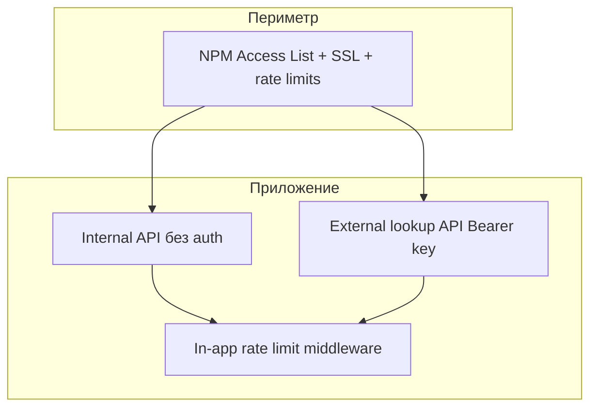

# Безопасность PSTN Analytics

Модель безопасности, аутентификация API, управление секретами и рекомендации по hardening в production.

---

## Принцип: perimeter-first

Приложение **не реализует** web-сессии, логин/пароль или RBAC. Защита рассчитана на размещение **за reverse proxy** (NGINX Proxy Manager) с:

- TLS (Let's Encrypt)
- Access List / Basic Auth / IP whitelist
- Rate limiting на прокси **и** in-app (см. ниже)



---

## Что защищено и чем

| Компонент | Защита | Примечание |
|-----------|--------|------------|
| UI `/ranges` | NPM Access List | Нет in-app auth |
| Internal API (`/api/ranges`, `/api/summary`, `/api/export`, `/api/import`, `/api/datasets`, `/api/v1/lookup/examples`) | NPM | Полный доступ к данным при обходе периметра |
| External lookup (`/api/v1/lookup`, `/api/v1/lookup/search`) | Bearer / `X-Api-Key` | Timing-safe compare |
| PostgreSQL | Docker internal network | Не публикуется в prod compose |
| Import API | NPM; `IMPORT_SECRET` опционален | Без secret импорт доступен на уровне приложения — защита периметром NPM |
| Secrets on disk | Volume `pstn_secrets`, chmod 600 | Ключ не в логах entrypoint |

---

## Internal API (без аутентификации в приложении)

Следующие endpoints **не проверяют** credentials на уровне приложения:

- `GET /api/ranges`, `/api/ranges/facets`, `/api/summary`, `/api/export/ranges`
- `GET /api/datasets`
- `POST /api/import`, `GET /api/import/status`
- `GET /api/v1/lookup/examples`, `/api/v1/lookup/config`
- `GET /api/health`

**Mitigation:** NPM Access List, VPN, bind app на `127.0.0.1:5555`, rate limits (NPM + in-app middleware).

---

## In-app rate limiting

Дополнение к NPM, не замена. Реализация: [`middleware.ts`](../middleware.ts), [`lib/api/rateLimit.ts`](../lib/api/rateLimit.ts). Лимит **per IP per process** (in-memory; сбрасывается при рестарте контейнера).

| Endpoint | Лимит по умолчанию | Env override |
|----------|-------------------|--------------|
| `POST /api/import` | 3 req / 10 min | `RATE_LIMIT_IMPORT=3/600000` |
| `GET /api/export/ranges` | 10 req / min | `RATE_LIMIT_EXPORT=10/60000` |
| `GET /api/ranges/facets` | 60 req / min | `RATE_LIMIT_FACETS=60/60000` |
| `/api/v1/lookup*` | 120 req / min | `RATE_LIMIT_LOOKUP=120/60000` |

Формат env: `maxRequests/windowMs`. При превышении: **429** + заголовок `Retry-After`, тело `{ "error": "Too many requests" }`.

IP берётся из `X-Forwarded-For` (первый hop) или `X-Real-IP`.

---

## HTTP security headers

В [`next.config.ts`](../next.config.ts): `Content-Security-Policy`, `Strict-Transport-Security` (только production), плюс `X-Content-Type-Options`, `X-Frame-Options`, `Referrer-Policy`, `Permissions-Policy`.

---

## Health endpoint

`GET /api/health` в **production** возвращает минимальный JSON: `{ "status": "ok", "database": "ok" }` — без hostname и revision (снижение reconnaissance).

Verbose (`version`, `uptimeSec`, …): `HEALTH_VERBOSE=1` или `NODE_ENV !== production`.

Invalid filters на `/api/ranges` возвращают **400** (не silent fallback) — снижает риск некорректных запросов, но не заменяет auth.

---

## External lookup API

Endpoints:

- `GET /api/v1/lookup?phone=<10 digits>`
- `GET /api/v1/lookup/search?phone=<mask>&page=&pageSize=`

### Аутентификация

Поддерживаются:

```http
Authorization: Bearer <EXTERNAL_API_KEY>
```

или

```http
X-Api-Key: <EXTERNAL_API_KEY>
```

Реализация: [`lib/api/externalApiAuth.ts`](../lib/api/externalApiAuth.ts)

- Сравнение ключа — **timing-safe** ([`lib/api/safeEqual.ts`](../lib/api/safeEqual.ts))
- При отсутствии `EXTERNAL_API_KEY` → **503** `SERVICE_UNAVAILABLE`
- Неверный ключ → **401** `UNAUTHORIZED`

### Ключ API

| Способ | Описание |
|--------|----------|
| Auto-generate | При первом старте контейнера → `/app/.secrets/external_api_key` |
| Fixed env | `EXTERNAL_API_KEY=...` в `.env` / Portainer |
| Retrieval | `docker compose exec app cat /app/.secrets/external_api_key` |

Ключ **не** выводится в логи entrypoint (только путь к файлу).

### UI: curl-примеры

- `GET /api/v1/lookup/config` → `{ configured, baseUrl }` — **без** ключа
- `GET /api/v1/lookup/examples?phoneMask=...` → `{ exactCurl, searchCurl, baseUrl }` — ключ встроен в готовые curl-строки (отдельного поля `apiKey` нет)

Доступ к `/examples` не защищён на уровне app — полагайтесь на NPM (внутренний периметр).

---

## Import API

`POST /api/import`, `GET /api/import/status`

### Модель аутентификации import

| Сценарий | Проверка | `IMPORT_SECRET` |
|----------|----------|-----------------|
| UI «Загрузить данные» (`triggeredBy: manual`) | `checkImportAuthorization` | Если **не задан** — OK. Если задан — UI **не шлёт header** → **401** |
| Cron scheduler (`triggeredBy: cron`) | `requireImportSecret` | **Обязателен**; без secret cron всегда 401 |
| `GET /api/import/status` | `checkImportAuthorization` | Как manual |

Реализация: [`lib/api/importAuth.ts`](../lib/api/importAuth.ts), timing-safe compare через [`lib/api/safeEqual.ts`](../lib/api/safeEqual.ts).

### Конфликт production (scheduler + UI)

Standard prod stack задаёт `IMPORT_SECRET` на **app** и **scheduler** (compose validation). Cron работает; кнопка «Загрузить данные» в UI — **нет**.

Workarounds: curl с `X-Import-Secret`, NPM inject header, убрать secret только на app. Подробнее: [import-and-datasets.md](import-and-datasets.md), [operations.md](operations.md).

### Diff snapshots и perimeter

Diff snapshots (`GET /api/datasets`, `?dataset=diff:<uuid>`) содержат исторические данные диапазонов. Защита — **тот же perimeter**, что для `/api/ranges` (NPM Access List). Отдельной auth на уровне app нет.

---

## Обработка ошибок

[`lib/api/errors.ts`](../lib/api/errors.ts):

- Production: `internalServerError()` **не** отдаёт `error.message` клиенту — generic fallback
- Development: детали ошибки в ответе для отладки
- Validation: `{ error: { code: "VALIDATION_ERROR", message, details: { issues } } }`

Формат ошибок:

```json
{
  "error": {
    "code": "ERROR_CODE",
    "message": "Human-readable message",
    "details": {}
  }
}
```

---

## HTTP security headers

[`next.config.ts`](../next.config.ts) для всех routes:

| Header | Value |
|--------|-------|
| `X-Content-Type-Options` | `nosniff` |
| `X-Frame-Options` | `DENY` |
| `Referrer-Policy` | `strict-origin-when-cross-origin` |
| `Permissions-Policy` | `camera=(), microphone=(), geolocation=()` |

CSP, HSTS — настраиваются на NPM (рекомендуется HSTS при SSL).

---

## Export: защита от formula injection

[`lib/export/sanitizeSpreadsheetCell.ts`](../lib/export/sanitizeSpreadsheetCell.ts) — префикс `'`` для ячеек, начинающихся с `=`, `+`, `-`, `@`, чтобы Excel/LibreOffice не интерпретировали данные как формулы.

---

## PostgreSQL

- Production compose: postgres **без** `ports:` — только internal network
- Dev `docker-compose.yml`: postgres на `127.0.0.1:5432` (не `0.0.0.0`)
- Пароли только через env, не в репозитории

---

## Зависимости и CI

- `npm run audit` → `npm audit --audit-level=high`
- CI ([`.github/workflows/ci.yml`](../.github/workflows/ci.yml)) падает на high/critical CVE
- Moderate advisories (esbuild dev, postcss, uuid/exceljs) — приняты, не блокируют CI

---

## Threat model (кратко)

| Угроза | Риск | Mitigation |
|--------|------|------------|
| Несанкционированный доступ к UI/API | Высокий | NPM Access List, VPN, localhost bind |
| Scraping lookup/export | Средний | In-app rate limits + NPM |
| Утечка EXTERNAL_API_KEY | Средний | Ключ в curl `/examples` **намеренно** (только за NPM); `/config` без ключа |
| DoS через import reload | Средний | In-app rate limit `/api/import`, advisory lock (один job) |
| SQL injection | Низкий | Drizzle parameterization, контролируемый `sql.raw` |
| Утечка stack trace в prod | Низкий | `internalServerError()` sanitization |
| Excel formula injection | Низкий | `sanitizeSpreadsheetCell` |
| Обход lookup auth | Низкий | Timing-safe key compare |

---

## Checklist production

- [ ] NPM: SSL + Access List на всех proxy hosts
- [ ] App слушает только `127.0.0.1:5555` или доступен только из docker-сети NPM
- [ ] Сильный `POSTGRES_PASSWORD`, не default
- [ ] `EXTERNAL_API_BASE_URL` задан для корректных curl-примеров
- [ ] Rate limits на NPM **и** проверка in-app 429 на export/lookup/import
- [ ] При `IMPORT_SECRET` на app: manual UI import не работает — используйте curl или workaround ([operations.md](operations.md))
- [ ] `/api/health` не exposed публично без необходимости
- [ ] Backup БД настроен ([operations.md](operations.md))
- [ ] Ключ lookup сохранён в password manager после первого deploy

---

## Связанные документы

- [import-and-datasets.md](import-and-datasets.md) — импорт, cron, diff snapshots (опорный документ)
- [deployment.md](deployment.md) — NPM, Portainer, env vars
- [npm.md](npm.md) — NGINX Proxy Manager
- [api-reference.md](api-reference.md) — endpoints и auth
- [operations.md](operations.md) — эксплуатация и troubleshooting
